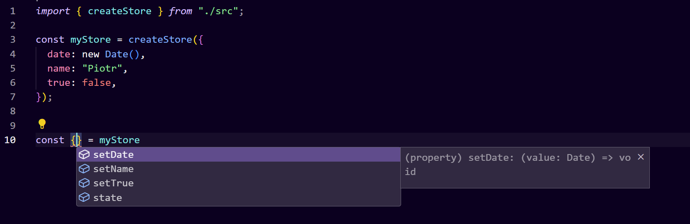

# Intellistore

Have you ever found yourself thinking

> Gee, I wish I could create dynamic, type-safe updaters and my IDE will add "set" prefix by itself?

Well, you're in luck!

This small library was born from the relentless monotony of typing [myState, setMyState] in React a million times. Curiosity met TypeScript, and now you have magically generated, type-safe updaters ✨



## How to install

- yarn add intellistore

## Example usage

```ts
import { createStore } from "intellistore";

interface MyStore {
  name: string;
  // Magic needs your key to be defined
  age?: number;
  // So this is the correct approach in this case
  age: number | undefined;
}

const myStore = createStore({
  name: "Piotr",
  age: undefined,
});

// And the magic begins
const { state, setName, setAge } = myStore;

setName("Name");
setAge(24);

// {name: "Name", age: 24}
console.log(state);
```
