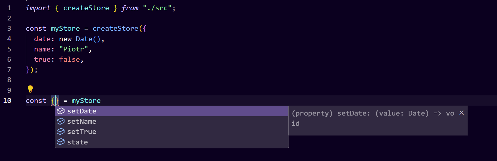

# Intellistore

Type-safe state with auto-generated, IDE-discoverable updaters. Hand it an
object and you get a fully typed `setX` method for every key - no boilerplate,
no hand-written `[value, setValue]` pairs.

It began as a way to stop typing `[myState, setMyState]` for the millionth time
and grew into a tiny, dependency-free store with functional updaters,
subscriptions, and a small extension API.



## Features

- Auto-generated, fully typed `setX` updater for every key
- Inferred from a plain object, or driven by an explicit interface — optional
  fields included
- Functional updaters: `setCount((n) => n + 1)`
- Subscriptions with discriminated `change` events
- Composable `with` extension API — add only what you need
- Zero dependencies

## Install

```sh
yarn add intellistore
# or
npm install intellistore
```

## Example usage

The simplest case needs no types at all — just pass an object and the updaters
are inferred:

```ts
import { createStore } from "intellistore";

const myStore = createStore({
  name: "Piotr",
  age: 24,
});

// And the magic begins
const { state, setName, setAge } = myStore;

setName("Name");
setAge(25);

// { name: "Name", age: 25 }
console.log(state);
```

### Optional fields

Plain optional keys (`age?: number`) now work directly — no need for the
`age: number | undefined` workaround. You can either initialize them with
`undefined` or omit them entirely; the matching setter always exists at both the
type level and runtime:

```ts
interface MyStore {
  name: string;
  age?: number;
}

const myStore = createStore<MyStore>({ name: "Piotr" }); // `age` omitted

const { state, setName, setAge } = myStore;

setName("Name");
setAge(24); // setAge is guaranteed to exist

// { name: "Name", age: 24 }
console.log(state);
```

### Functional updaters

Every setter accepts either a new value or an updater function that receives the
previous value:

```ts
const { state, setCount } = createStore({ count: 0 });

setCount(10);
setCount((current) => current + 1);

// { count: 11 }
console.log(state);
```

> Note: because the updater is detected with `typeof value === "function"`,
> storing a function _as a value_ is ambiguous — pass it via an updater
> (`setFn(() => myFunction)`) in that case.

### Subscriptions

`subscribe` is called after every change that actually updates the state, and
returns an unsubscribe function. The listener receives the current state and a
`change` describing what happened (discriminated by `key`):

```ts
const store = createStore({ count: 0 });

const unsubscribe = store.subscribe((state, change) => {
  console.log(`${String(change.key)}: ${change.previous} -> ${change.value}`);
});

store.setCount(1); // logs "count: 0 -> 1"
store.setCount(1); // no log: value did not change
unsubscribe();
```

### Extending the store

Rather than baking in every feature, the store exposes three primitives —
`state`, `set`, and `subscribe` — and lets you build on them with `with`. Each
call is independently type-inferred and chainable, so the extra members are
fully typed on the returned store:

```ts
const store = createStore({ count: 0 })
  .with((s) => ({
    increment: () => s.set("count", (n) => n + 1),
    reset: () => s.set("count", 0),
  }))
  .with((s) => ({
    // batch update several keys at once
    patch: (values: Partial<typeof s.state>) => {
      for (const key of Object.keys(values) as (keyof typeof s.state)[]) {
        s.set(key, values[key]!);
      }
    },
  }));

store.increment(); // typed
store.reset(); // typed
store.patch({ count: 42 }); // typed
```

This keeps the core tiny while letting you add things like batch updates,
persistence, logging, or undo/redo without forking the library. The reserved
members `state`, `subscribe`, and `with` cannot be overridden by an extension.
